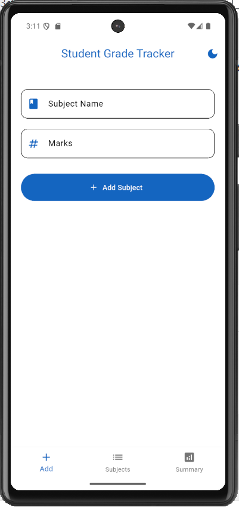
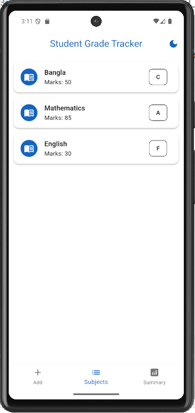
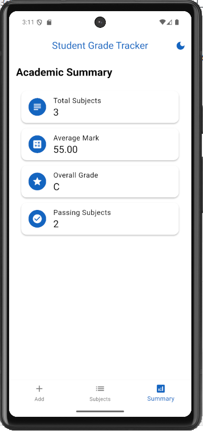
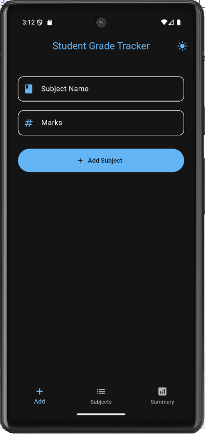
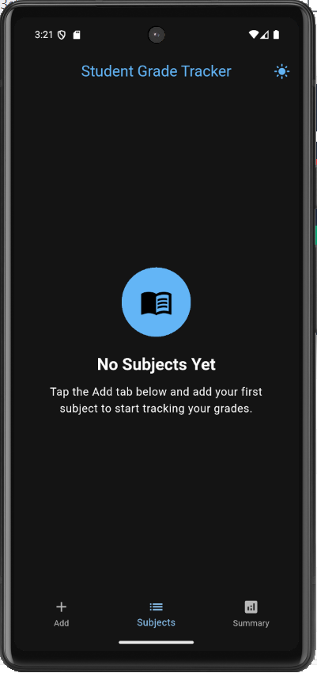
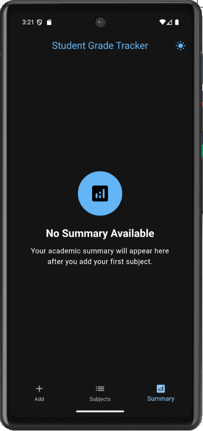

# Student Grade Tracker

A Flutter application developed for the Module 5 Assignment.


## Features

- 📚 Add subjects with marks
- 📝 Automatic grade calculation using A, B, C and F
- 📊 Academic summary dashboard
- 🗑️ Subject lists with Swipe to delete subjects
- 🌗 Light & Dark mode
- ✅ Form validation
- 📱 Material 3 UI
- ⚡ Provider state management

## 📱 Screenshots

| Add Subject | Subject List |
|-------------|--------------|
|  |  |

| Summary | Dark Theme |
|----------|------------|
|  |  |

| No Subject | No Summary |
|----------|------------|
|  |  |
## Technologies

- Flutter
- Dart
- Provider
- Material 3

## Project Structure

```
lib/
├── models/
├── providers/
├── screens/
├── theme/
├── utils/
└── widgets/
```

## Getting Started

```bash
flutter pub get
flutter run
```

## Requirements Covered

- ✅ 3 Screens
- ✅ Bottom Navigation
- ✅ Theme Toggle
- ✅ Private `_mark`
- ✅ Grade Getter
- ✅ `.where()`
- ✅ Form Validation
- ✅ ListView.builder
- ✅ Dismissible
- ✅ Provider State Management
- ✅ No setState()
- ✅ Material 3

## Author

**Sazia Sultana Shammi**